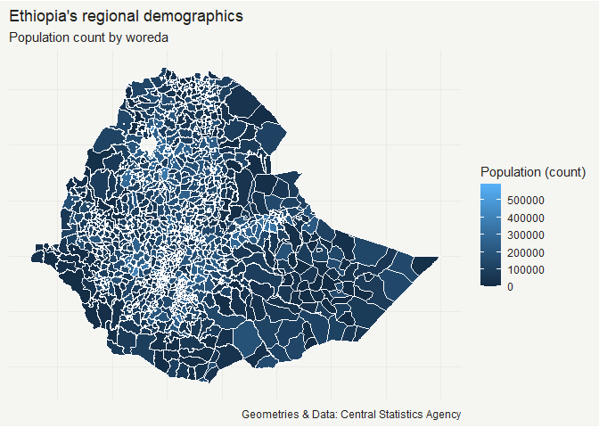
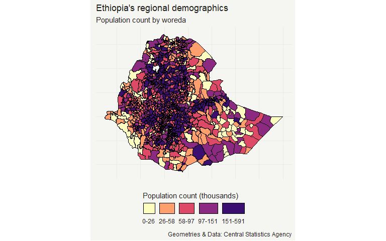
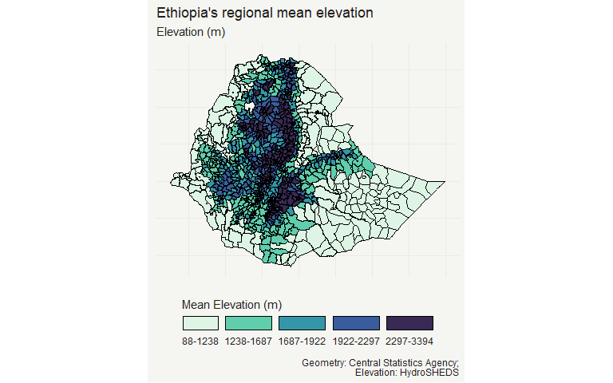
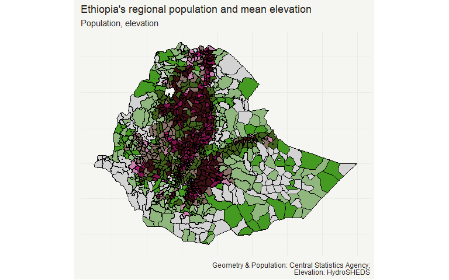
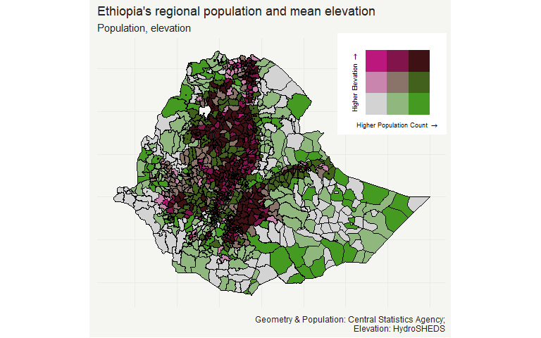

Bivariate Choropleth Map
================
Geoff
2022-12-17

# Introduction

Recently I came across an
[article](https://timogrossenbacher.ch/2019/04/bivariate-maps-with-ggplot2-and-sf/)
demonstrating some creative mapping techniques in ggplot, and I thought
it would be fun to explore them as it can be so difficult to communicate
more than one concept in mapping. I enjoyed delving into the author’s
approach and using the
[biscale](https://chris-prener.github.io/biscale/articles/biscale.html)
package which they developed specifically for this use case.

# Code

## Setup

Load the relevant packages.

``` r
library(tidyverse)
library(ggplot2)
library(viridis)
library(sf)
library(raster)
library(biscale)
library(cowplot)
```

For the purposes of creating a more readily interpretable visualization,
we’ll turn off scientific notation.

``` r
options(scipen=999)
```

The original author builds a clean and tidy custom theme off of
“theme_minimal” by turning off a several label options and using a
neutral color palette.

``` r
theme_map <- function(...) {
  theme_minimal() +
  theme(
    text = element_text(color = "#22211d"),
    axis.line = element_blank(),
    axis.text.x = element_blank(),
    axis.text.y = element_blank(),
    axis.ticks = element_blank(), 
    axis.title.x = element_blank(),
    axis.title.y = element_blank(), 
    panel.grid.major = element_line(color = "#ebebe5", size = 0.2),
    panel.grid.minor = element_blank(), 
    plot.background = element_rect(fill = "#f5f5f2", color = NA), 
    panel.background = element_rect(fill = "#f5f5f2", color = NA), 
    legend.background = element_rect(fill = "#f5f5f2", color = NA),
    panel.border = element_blank(),
    ...
  )
}
```

## Univariate Mapping

### Population Map

The final bivariate map will visualize population and elevation at the
woreda level (third administrative division) in Ethiopia.
[Administrative boundaries](https://data.humdata.org/dataset/cod-ab-eth)
and [population](https://data.humdata.org/dataset/cod-ps-eth) figures
come from the Humanitarian Data Exchange and are maintained by
Ethiopia’s Central Statistics Agency. The elevation data comes from the
[HydroSHEDS](https://www.hydrosheds.org/hydrosheds-core-downloads)
digital elevation model at the 30 arc seconds resolution.

``` r
# Elevation data from HydroSHEDS
dem <- raster("./hyd_af_dem_30s/hyd_af_dem_30s.tif")

# Administrative boundaries off of humdataX
eth <- read_sf("./eth_adm_csa_bofedb_2021_shp/eth_admbnda_adm3_csa_bofedb_2021.shp")

# population from humdataX
pop <- read.csv("./eth_admpop_adm3_2022_v2.csv")
```

To link our population data to our boundaries shapefile, we can execute
a join using the “ADM3_PCODE” variable as a common key.

``` r
# We can join the eth and pop dataframes on the "ADM3_PCODE" variable
eth_pop <- eth %>%
  dplyr::select(ADM3_PCODE, geometry) %>%
  left_join(pop, by = c("ADM3_PCODE")) %>%
  rename(ADM3_EN = ï..ADM3_EN, 
         total_pop = T_TL) %>%
  dplyr::select(ADM3_EN, ADM3_PCODE, ADM2_EN, ADM2_PCODE, ADM1_EN, ADM1_PCODE, total_pop, geometry)
```

As a starting point, we’ll create a basic univariate map of population
data before adding more bells and whistles.

``` r
p1 <- ggplot() + 
  geom_sf(data = eth_pop, aes(fill = total_pop), color = "white", size = 0.03) +
  theme_map() +
  labs(x = NULL, 
       y = NULL, 
       title = "Ethiopia's regional demographics",
       subtitle = "Population count by woreda",
       caption = "Geometries & Data: Central Statistics Agency",
       fill = "Population (count)"
  ) 

p1
```

<!-- -->

As you can see, it is difficult to discern much of the variation in the
data across woredas in the basic map. One way to address this issue is
by classifying the data into quantiles.

``` r
# For this demonstration, we'll use the quantile function to identify the breakpoints for quintile classification. 
quantiles_pop <- quantile(eth_pop$total_pop / 1000, probs = c(0, 0.20, 0.40, 0.60, 0.80, 1)) %>%
  round(., 0)

# Once we have the breakpoints, we can use the cut function to create a new variable in our dataframe representing the quintile boundaries and the stringr package to clean up the special characters for a cleaner visualization. 
eth_pop_quant <- eth_pop %>%
  dplyr::select(ADM3_EN, ADM3_PCODE, total_pop, geometry) %>%
  mutate(total_pop = as.numeric(total_pop/1000), 
         total_pop_quant = cut(total_pop, breaks = quantiles_pop, include.lowest=T), 
         total_pop_quant = stringr::str_replace(total_pop_quant, ",", "-"),
         total_pop_quant = stringr::str_remove(total_pop_quant, "\\("),
         total_pop_quant = stringr::str_remove(total_pop_quant, "\\]"), 
         total_pop_quant = stringr::str_remove(total_pop_quant, "\\["),
         total_pop_quant = as.factor(total_pop_quant))

# Set the levels of the quintile variable
eth_pop_quant$total_pop_quant <- factor(eth_pop_quant$total_pop_quant, levels = c("0-26", "26-58", "58-97", "97-151", "151-591"))
```

Now that our data is divided into quantiles, we can also employ a more
vibrant color palette from the viridis package to make the data pop even
more.

``` r
p2 <- ggplot() + 
  theme_map() + 
  geom_sf(data = eth_pop_quant, aes(fill = total_pop_quant), color = "black", size = 0.02) +
  labs(x = NULL, 
       y = NULL, 
       title = "Ethiopia's regional demographics",
       subtitle = "Population count by woreda",
       caption = "Geometries & Data: Central Statistics Agency",
       fill = "Population (count)"
  ) +
  scale_fill_viridis(option = "magma",
                     name = "Population count (thousands)",
                     discrete = T,
                     direction = -1,
                     guide = guide_legend(
                       keyheight = unit(5, units = "mm"),
                       title.position = "top",
                       reverse = T)
                     ) 
p2
```

<!-- -->

Another handy tweak from the tutorial that we can mimic is reducing the
extremes in the color palette to make the overall impression more
harmonious. To do this, we’ll use the “magma” argument of the
“scale_fill_manual” function to generate six levels of the magma color
palette but subset the palette to use only the lightest five colors. The
resulting map will exclude the darkest purple color in favor of
something less extreme. To save some space, we can also move the legend
to the bottom of the figure.

``` r
breaks <- levels(eth_pop_quant$total_pop_quant)

p3 <- ggplot() + 
  theme_map() + 
  geom_sf(data = eth_pop_quant, aes(fill = total_pop_quant), color = "black", size = 0.02) +
  labs(x = NULL, 
       y = NULL, 
       title = "Ethiopia's regional demographics",
       subtitle = "Population count by woreda",
       caption = "Geometries & Data: Central Statistics Agency",
       fill = "Population (count)"
  ) +
  theme(legend.position = "bottom") +
  scale_fill_manual(
    # we'll set six levels of magma and only use the lightest 5
    values = magma(6)[2:6],
    breaks = rev(breaks),
    name = "Population count (thousands)",
    guide = guide_legend(
      direction = "horizontal",
      title.position = "top",
      label.position = "bottom",
      reverse = T
    )) 

p3
```

<!-- -->
Great! Now that we’ve created a polished univariate map, we can turn our
attention towards incorporating another variable.

### Elevation Map

Since our DEM raster covers the entire African continent, we’ll crop and
mask it to the Ethiopia’s national boundaries.

``` r
eth_dem <- raster::crop(dem, eth) %>%
  raster::mask(., eth)
  plot(eth_dem)
```

<!-- -->

For the purposes of our choropleth map, we can use zonal statistics from
the raster package to extract the mean elevation by woreda and join this
variable to our population data. We can turn this output into an sf
object, which will be easier to work with.

``` r
eth_pop_dem <- raster::extract(eth_dem, eth_pop_quant, fun = mean, na.rm = T, sp = T) %>%
  sf::st_as_sf()
```

Now that we have the mean elevation by woreda, we can classify elevation
into quantiles just as we did with the population data.

``` r
quantiles_dem <- quantile(eth_pop_dem$hyd_af_dem_30s, probs = c(0, 0.20, 0.40, 0.60, 0.80, 1)) %>%
  round(., 0)

eth_pop_dem_quant <- eth_pop_dem %>%
  dplyr::select(ADM3_EN, ADM3_PCODE, total_pop, hyd_af_dem_30s, geometry) %>%
  rename(dem = hyd_af_dem_30s) %>%
  mutate(dem_quant = cut(dem, breaks = quantiles_dem, include.lowest=T, dig.lab = 10),
         dem_quant = stringr::str_replace(dem_quant, ",", "-"),
         dem_quant = stringr::str_remove(dem_quant, "\\("),
         dem_quant = stringr::str_remove(dem_quant, "\\]"), 
         dem_quant = stringr::str_remove(dem_quant, "\\["),
         dem_quant = as.factor(dem_quant))

eth_pop_dem_quant$dem_quant <- factor(eth_pop_dem_quant$dem_quant, levels = c("88-1238", "1238-1687", "1687-1922", "1922-2297", "2297-3394"))
```

Plot the DEM raster

``` r
breaks <- levels(eth_pop_dem_quant$dem_quant)

e <- ggplot() + 
  theme_map() + 
  geom_sf(data = eth_pop_dem_quant, aes(fill = dem_quant), color = "black", size = 0.02) +
  labs(x = NULL, 
       y = NULL, 
       title = "Ethiopia's regional mean elevation",
       subtitle = "Elevation (m)",
       caption = "Geometry: Central Statistics Agency;\nElevation: HydroSHEDS",
       fill = "Mean elevation (m)"
  ) +
  theme(legend.position = "bottom") +
  scale_fill_manual(values = mako(6)[2:6],
                    breaks = rev(breaks),
                    name = "Mean Elevation (m)",
                    guide = guide_legend(
                       direction = "horizontal",
                       keyheight = unit(5, units = "mm"),
                       title.position = "top",
                       label.position = "bottom",
                       reverse = T)
                     ) 
e
```

<!-- -->

## Bivariate map

To create a bivariate map that shows both population counts and
elevation, we’ll reduce our number of classes per variable (high,
medium, low), and create a color ramp with 9 levels to show the
interaction between the two variables (high-high, high-medium, high-low
etc). The biscale package has a few useful tools to help us here.

The bi-class function will create a var “bi-class” in our dataframe that
classifies each woreda by population and elevation.

``` r
eth_bivariate <- bi_class(eth_pop_dem_quant, x = total_pop, y = dem, style = "quantile", dim = 3)
eth_bivariate
```

    ## Simple feature collection with 1082 features and 6 fields
    ## Geometry type: MULTIPOLYGON
    ## Dimension:     XY
    ## Bounding box:  xmin: 32.9918 ymin: 3.40667 xmax: 47.98824 ymax: 14.84548
    ## Geodetic CRS:  WGS 84
    ## First 10 features:
    ##              ADM3_EN ADM3_PCODE total_pop      dem
    ## 1     Tahtay Adiyabo   ET010101   107.741 1022.838
    ## 2      Laelay Adiabo   ET010102   136.058 1510.836
    ## 3               Zana   ET010103    15.127 1596.472
    ## 4      Tahtay Koraro   ET010104    78.165 1737.757
    ## 5             Asgede   ET010105    62.171 1098.802
    ## 6           Tselemti   ET010106   164.957 1238.191
    ## 7       Sheraro town   ET010107    34.471 1036.824
    ## 8  Indasilassie town   ET010108    95.491 1914.188
    ## 9          Selekleka   ET010109    14.679 1898.728
    ## 10    Seyemti Adyabo   ET010110    52.228 1477.348
    ##                          geometry dem_quant bi_class
    ## 1  MULTIPOLYGON (((37.94371 14...   88-1238      2-1
    ## 2  MULTIPOLYGON (((38.33372 14... 1238-1687      3-1
    ## 3  MULTIPOLYGON (((38.45362 14... 1238-1687      1-2
    ## 4  MULTIPOLYGON (((38.30191 14... 1687-1922      2-2
    ## 5  MULTIPOLYGON (((37.96121 14...   88-1238      2-1
    ## 6  MULTIPOLYGON (((38.68013 13... 1238-1687      3-1
    ## 7  MULTIPOLYGON (((37.81101 14...   88-1238      1-1
    ## 8  MULTIPOLYGON (((38.2732 14.... 1687-1922      2-2
    ## 9  MULTIPOLYGON (((38.35633 14... 1687-1922      1-2
    ## 10 MULTIPOLYGON (((38.19488 14... 1238-1687      2-1

Using the bi_pal function and specifying our dimensions (the number of
classes per variable), we can select a palette that we want to use.

``` r
biscale::bi_pal("PinkGrn", dim = 3)
```

<!-- -->

Next, we’ll map the bi_class variable using the “fill” argument and
assign our chosen color palette with “bi_scale_fill.”

``` r
b <- ggplot() +
  geom_sf(data = eth_bivariate, aes(fill = bi_class), color = "black", size = 0.1) +
  bi_scale_fill("PinkGrn", dim = 3) +
  theme_map() + 
  theme(legend.position = "none") + 
  labs(x = NULL, 
       y = NULL, 
       title = "Ethiopia's regional population and mean elevation",
       subtitle = "Population, elevation",
       caption = "Geometry & Population: Central Statistics Agency;\nElevation: HydroSHEDS",
  ) 

b
```

<!-- -->

To give readers some guidance, we’ll create a 3x3 legend element, which
we can add to the map using the “cowplot” package.

``` r
legend <- bi_legend(pal = "PinkGrn",
                    dim = 3,
                    xlab = "Higher Population Count ",
                    ylab = "Higher Elevation ",
                    size = 7)
legend
```

<!-- -->

The final output shows the relationship between population and elevation
across woredas in Ethiopia. Many of the highest elevation woredas in the
central Abyssinian highlands also have the highest populations.

``` r
# combine map with legend
finalPlot <- cowplot::ggdraw() +
  draw_plot(b, 0, 0, 1, 1) +
  draw_plot(legend, 0.6, 0.6, 0.25, 0.3)

finalPlot
```

<!-- -->

And that’s it! This is a fun and engaging way to present two variables
together in the same visual, and I’m looking forward to finding ways to
incorporate it into my work.
